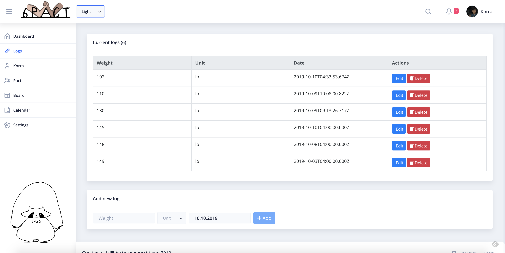
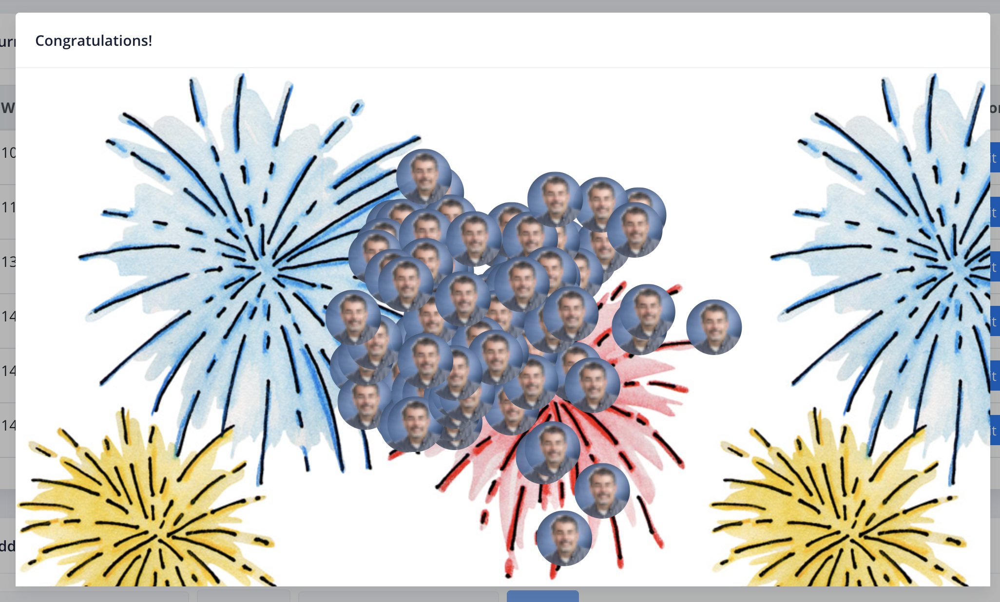
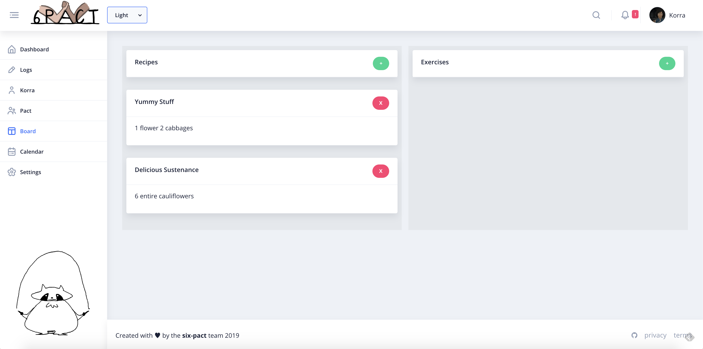
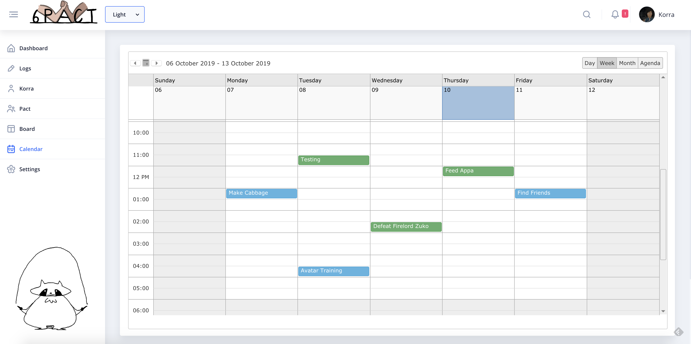
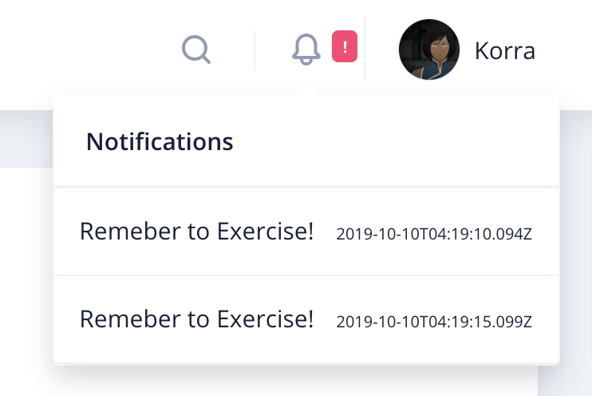
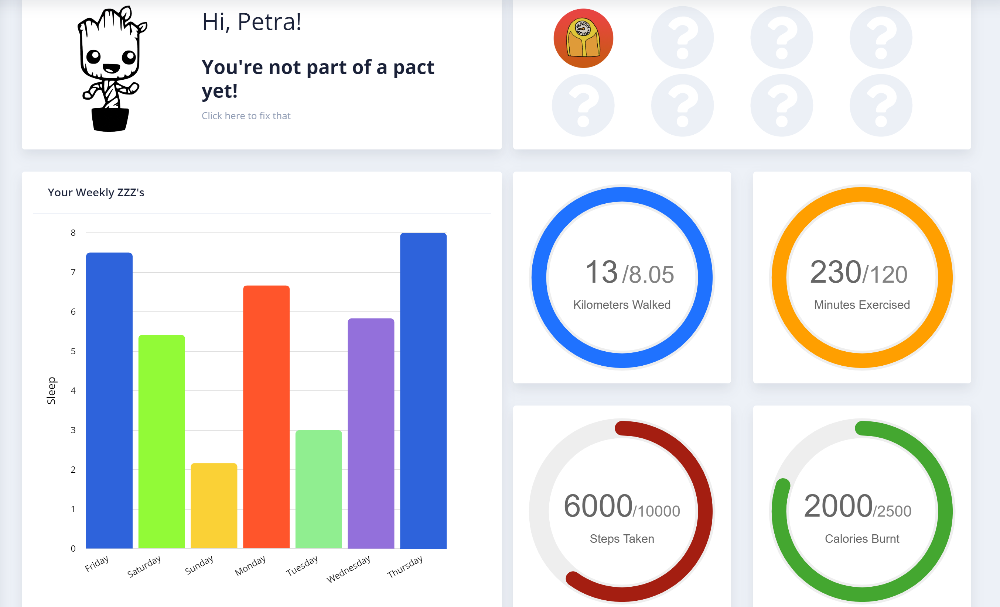
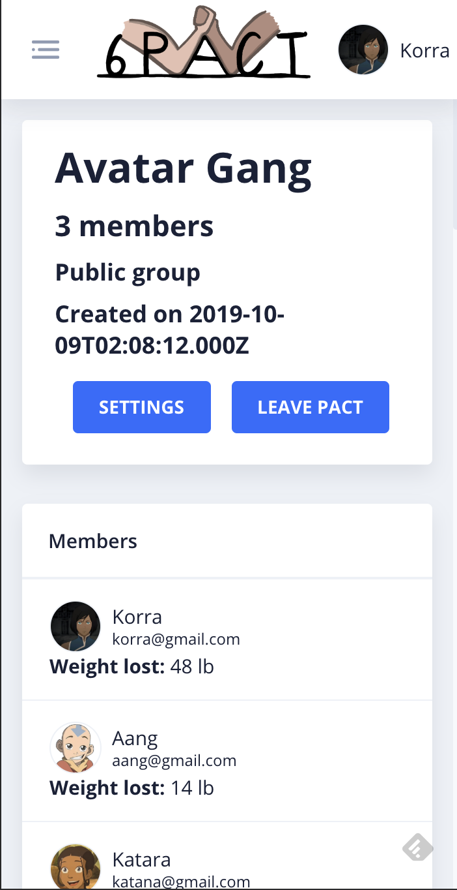
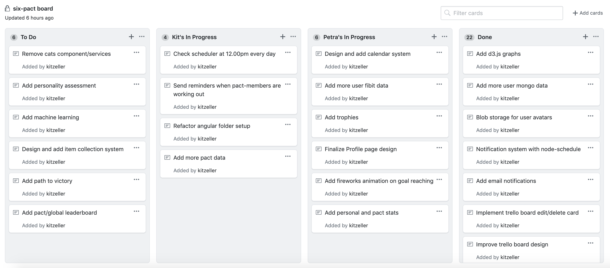
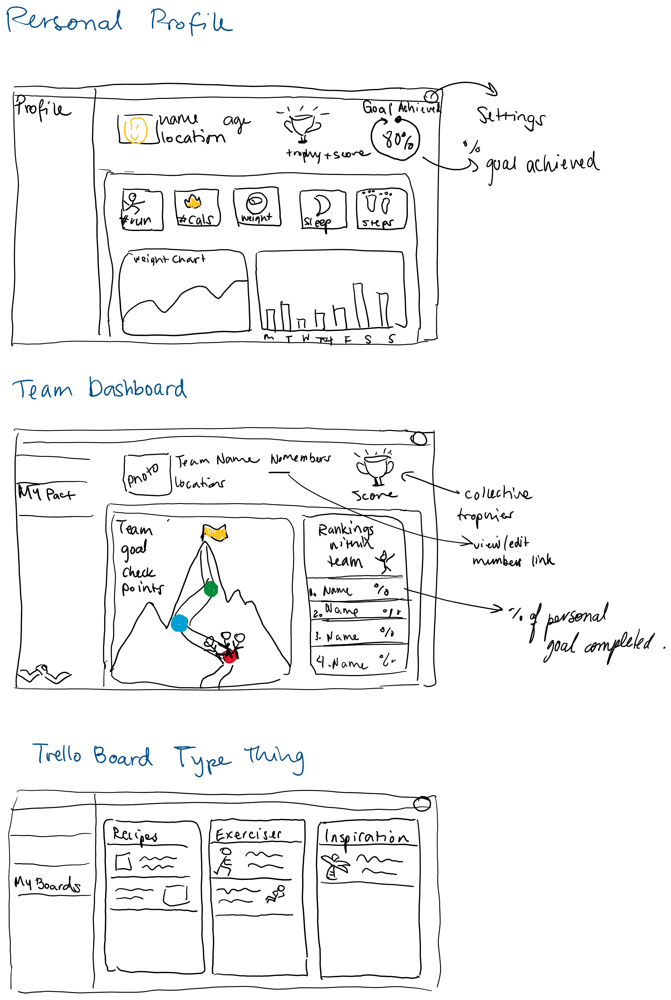

Developed by Kit Zellerbach and Petra Kumi

https://six-pact.herokuapp.com

We created a web app that would facilitate group weight loss competitions, known as 'six pact'. We created
an example pact that you can use.

#### Login Information
Username: korra@gmail.com

Password: password

#### Technologies Used
We used several technologies, such as:

- Angular CLI 8: We used this as the client's web framework
- Nebular UI: We used this as our UI library
- D3.js: We used this to create charts and animations
- jQScheduler: We used this for our calendar
- Nodescheduler: We used this to send scheduled notifications
- MongoDB: We used this as our database
- Typescript: We programmed both our frontend and backend with this
- Node.js: We used this for the server
- Google Cloud S3: We used this for blob (image) storage for user avatars
- Multer Middleware: We used this to access image from http requests
- Fitbit Integration: We used this for more user data
- Nodemailer: We used this to send emails

#### Challenges
The main challenges were developing in Angular CLI, as well as integrating several technologies together in one app.
The app was created to be extremely scalable and modular, reusing components often.
A big challenge between the two of us was to adapt to each other's level of knowledge: Petra had never worked with Angular, 
typescript, or blob storage before, so we had to work very closely together to make sure she moved past the learning curve 
as quickly as possible. 
We were able to overcome this challenge by being patient, understanding each other's limitations, and motivating each other.
At the end of the day we both learned a lot!

#### Responsibilities
Both members of the group collaborated together on most of the features. However, given Kit's previous experience with our main
libraries she was able to work much faster than Petra. Our jobs were split as follows:

Kit:
- Created initial framework
    - Set up Angular project with Nebular UI
    - Set up fitbit auth (including the privacy policy and terms of service pages required)
    - Implemented NodeJS server with MongoDB
- Designed database and authentication system 
- Set up the pact system
- Set up the weight logging system
- Designed and implemented the "trello" board
- Designed the settings and preferences sections of our site
- Set up email and in-site notifications
- Set up cloud blob storage
- Worked on the calendar system

Petra:
- Designed profile page
- Implemented graphs and charts
    - Used Angular 8 and Nebular UI components for graphs
    - Created the progress circles from scratch using SVGs
- Retrieved data from the Fitbit API to populate profile page
- Set up a badge collection system for users, integrating fitbit badges with custom-made ones
- Worked on the calendar system
- Added details such as hover over avatar and click to change avatar photo

## System Design Document

### Features

#### Logs & Charlieworks

Users can use the log page to log their current weight.
When users reach their goal weight they are presented with fireworks. These were created using d3.js.

#### Trello Board

There is a trello board for exercise and recipe sharing that is private to pact members. Nebular UI cards
were used in combination with Angular Material drag and drop functionality.

#### Calendar

A calendar was implemented using jqxScheduler. This allows pact members to see each other's workout schedules and set their own.
There are also options to download the calendar as CSV, JSON, and ICS data.

#### Reminder Notifications 

Node-scheduler (a flexible cron-like and not-cron-like job scheduler for Node.js) is used on the back-end to send reminder
notifications every day at 12.00pm, and then weekly results on Sunday at
12.00pm.

#### Badge Collection

Users are able to collect badges based on their achievements, and Fitbit data. Badges show on the profile page and are 
persistently stored in the database.

#### Profile Page

Users are able to see data about their logged activities in their profile page. This is intended to be a location that 
provides quick and easy information to the user, as well as access to other resources in the site such as joining or creating a pact. 

#### Mobile Compatibility

The app also scales/responds to mobile dimensions.

## Project Work

### Task Management

### UI Mockups

